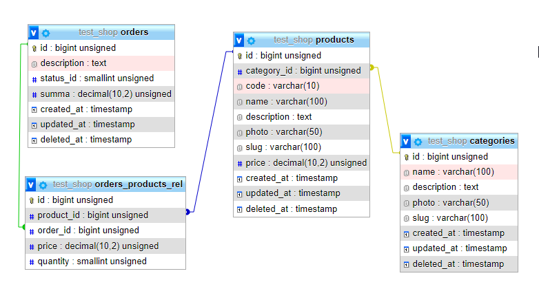

## Test Laravel Shop

### Описание сущностей
- Имеем три сущности: Products, Categories, Orders
- один продукт принадлежит к одной категории
- один продукт может быть в нескольких заказах
- один заказ может содержать несколько продуктов
- один заказ принадлежит одному пользователю
- один пользователь может иметь несколько заказов

### Схема базы данных

